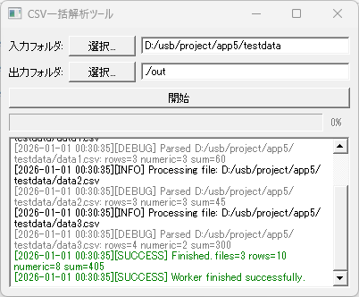

# Qt Thread CSV Processor


Qt5 を使用して作成した、**CSV ファイルの解析をバックグラウンドスレッドで実行するサンプルアプリケーション**です。  
Qt を用いた GUI + マルチスレッド処理の実装例として作成しました。

大量の CSV を安全に処理しつつ、UI の応答性を保つ構成になっており、  
小規模〜中規模の業務ツールのベースとして利用できます。

---

## 🛠 使用技術

- **Qt 5.x（Qt Widgets）**
- **C++17**
- **QThread によるバックグラウンド処理**
- **QFile / QTextStream によるファイル入出力**
- **RFC4180 に準拠した CSV パーサ**
- **CMake（ビルドシステム）**
- **GitHub Actions（Windows 自動ビルド）**

---

## 📌 機能概要

- 指定フォルダ内の CSV ファイルを一括解析  
- **バックグラウンドスレッドで処理し、UI の応答性を維持**
- CSV の行数・数値カウント・合計値を集計  
- summary.txt に解析結果を出力  
- **ログレベル（Debug / Info / Warn / Error / Success）に応じた色付きログ表示**
- 処理の進捗をプログレスバーで表示  
- ユーザによる処理キャンセルに対応

---

## 🧩 実装ポイント

- **Worker（QThread）** による非同期処理  
  - UI スレッドをブロックしない安全な設計  
  - atomic フラグによるキャンセル処理  
- **CsvParser**  
  - RFC4180 に準拠した CSV パース  
  - クォート・改行・エスケープ `""` に対応  
- **Logger**  
  - スレッドセーフなログ出力  
  - Debug ログは Release ビルドで自動的に無効化  
  - HTML とプレーンテキストを分離した設計  
- **MainWindow**  
  - UI 状態管理（Idle / Running）  
  - ログビューの自動追従  
  - 入出力フォルダ選択ダイアログ  
- **CMake + GitHub Actions**  
  - Windows（MinGW）向け自動ビルド  
  - アーティファクトとして exe を生成（期限後自動削除）

---

## ⚠️ 制限事項 / 注意事項

- CSV の解析内容は「1列目の数値集計」に限定しています（サンプル仕様）。  
- summary.txt のフォーマットは簡易的です。  
- ログローテーションや非同期ログは実装していません（必要に応じて外部ロガーに差し替え可能）。  
- GUI は Qt Widgets ベースで、レイアウトはコードで構築しています。

---

## 📁 ディレクトリ構成

```
qt-thread-csv-sample/
├─ .gitignore               # Git 管理対象外ファイル設定
├─ .github
│  └─ workflows
│     └─ build.yml          # GitHub Actions（Windows 自動ビルド）
├─ CMakeLists.txt           # CMake 設定
├─ main.cpp                 # エントリポイント
├─ MainWindow.cpp  / .h     # GUI（Qt Widgets）
├─ Worker.cpp  / .h         # QThread によるバックグラウンド処理
├─ CsvParser.cpp  / .h      # RFC4180 CSV パーサー
├─ FileEnumerator.cpp  / .h # CSV ファイル列挙
├─ Logger.cpp  / .h         # スレッドセーフなログ出力
├─ README.md                # プロジェクト説明
└─ images
   └─ screenshot.png        # 画面イメージ

```

---

## 📂 ビルド方法

### CMake を使用する場合

1. Qt 5.x（MinGW）と CMake をインストール  
2. プロジェクトルートで以下を実行

```
cmake -B build -DCMAKE_BUILD_TYPE=Release
cmake --build build
```


3. `build/` 内に実行ファイルが生成されます

---

## 📷 画面イメージ



---

## 📄 License
This project is licensed under the MIT License.

---

## 📫 連絡について

ご相談やご依頼がありましたら、以下のメールアドレスまでご連絡ください。

📧 acc.vcc.work@gmail.com

丁寧に対応いたします。
